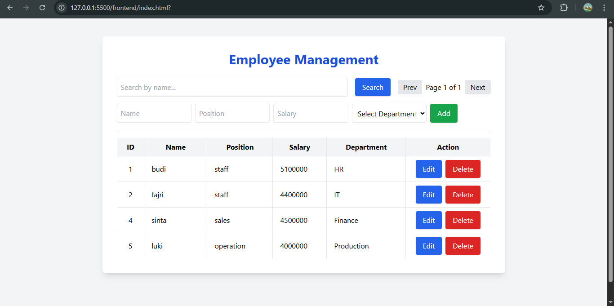

# Employee Management CRUD

A simple Employee Management web application featuring Create, Read, Update, and Delete (CRUD) operations, built with:

- **Frontend:** AngularJS (HTML, JavaScript, TailwindCSS)
- **Backend:** Express.js (Node.js)
- **Database:** SQL Server

---

## Features

- List employees with pagination and search by name
- Add new employees (with name, position, salary, and department)
- Edit and update employee data
- Delete employees
- Department selection via dropdown (relational one-to-many: each employee has a department)
- Responsive and clean UI

---

## Architecture

- **Frontend** (`/frontend`):  
  - Built with AngularJS (1.x) for simplicity.
  - Consumes REST API from backend for all employee and department data.
  - Uses TailwindCSS for quick and modern styling.
- **Backend** (`/backend`):  
  - Express.js REST API.
  - Handles all CRUD operations and business logic.
  - Connects to SQL Server using `mssql` package.
  - Provides API endpoints:
    - `GET /api/employees` (pagination, search)
    - `POST /api/employees`
    - `PUT /api/employees/:id`
    - `DELETE /api/employees/:id`
    - `GET /api/employees/departments` (for department dropdown)
- **Database**:  
  - SQL Server with two tables: `Employees` and `Departments`.
  - `Employees` table has a foreign key to `Departments`.

---

## How It Works

1. **User Interface**  
   The app displays a table of employees with search and pagination controls.  
   Users can add, edit, or delete employee entries.  
   Department is selected from a dropdown list.

2. **API Communication**  
   The frontend sends HTTP requests to the backend Express API.  
   All data operations (CRUD) are performed via these endpoints.

3. **Database**  
   Backend executes SQL queries to fetch, insert, update, or delete employee and department data.

---

## Getting Started

### 1. Database (SQL Server)
- Create `Departments` and `Employees` tables:
    ```sql
    CREATE TABLE Departments (
      DepartmentID INT IDENTITY(1,1) PRIMARY KEY,
      DepartmentName VARCHAR(50) NOT NULL
    );

    CREATE TABLE Employees (
      EmployeeId INT IDENTITY(1,1) PRIMARY KEY,
      Name VARCHAR(50),
      Position VARCHAR(50),
      Salary INT,
      DepartmentID INT FOREIGN KEY REFERENCES Departments(DepartmentID)
    );
    ```
- Insert some initial departments and employees.

### 2. Backend
- Configure your SQL Server connection in `/backend/db.js`.
- Run backend server:
    ```sh
    cd backend
    npm install
    npm run dev
    ```

### 3. Frontend
- Open `/frontend/index.html` using Live Server extension (VSCode) or similar, or open in your browser.
- Make sure to update API endpoint URLs in frontend JS if backend runs on a different port.

---

## Example Screenshot


---

## Credits

- AngularJS
- Express.js
- SQL Server
- TailwindCSS

---

## License

MIT